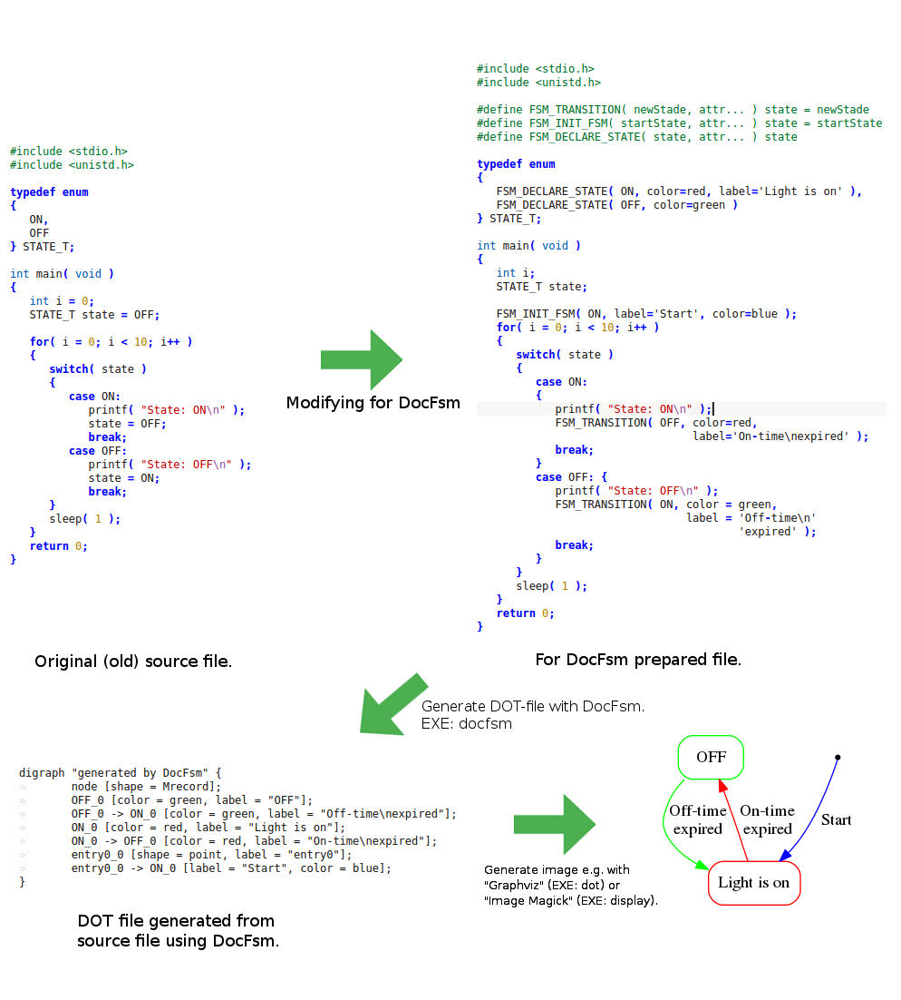
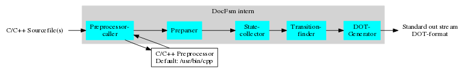

DocFsm
======

DocFsm is a lightweight documentation-, developing- and reverse- engineering tool to
visualizing <b>F</b>inite <b>S</b>tate <b>M</b>achines (FSM) written in C or C++.

- Integratable in sourcecode documentations generated by Doxygen.

At the moment for Linux only. Version 1.4

Requirement
------------
Using DocFsm requires following additional programs:
- <b>Graphviz</b>: Graph visualization software. https://www.graphviz.org
- <b>Image Magick</b>: Displaying images. https://www.imagemagick.org (optional)

Quick Tutorial
--------------
To generating a dot-file from a C/C++ source-file, type quite simply:
```
docfsm myFsm.cpp > myFsm.gv
```
The following example shows how a PDF-file becomes generated from a source-file:
```
docfsm myFsm.cpp | dot -Tpdf -o myFsm.pdf
```

If you have ImageMagick installed so you can also display directly form the source-code:
```
docfsm myFsm.cpp | display
```
If your version of ImageMagick doesn't support the dot-language then try this:
```
docfsm myFsm.cpp | dot -Tpng | display
```
The following illustration shows the standard process documenting and displaying FSMs:


As shown above you only need to define three additional macros in your source code:
- ```FSM_TRANSITION```
- ```FSM_INIT_FSM```
- ```FSM_DECLARE_STATE```

Whereby ```FSM_DECLARE_STATE``` is optional, but for example if you want to colored the states, so you need it.
The most important macro is ```FSM_TRANSITION``` and its aliases.</br>
Please refer also: http://www.graphviz.org/pdf/dotguide.pdf


<b>NOTE:</b> If you'll define labels as attributes so put the text in ```' '``` rather than in ```" "```.</br>
DocFsm will substitute (') in (") .

<b>NOTE:</b> If if you have implemented a FSM with switch-case statements so it becomes necessary
to use braces ```{}``` for each case-statement. DocFsm expect this! (See also illustration above.)</br>
Example:
```c
   ...
   case A_STATE:
   {
      // do something
      if( condition )
      {
         FSM_TRANSITION( A_OTHER_STATE, label='change to the other state' );
         break;
      }
      FSM_TRANSITION_SELF( label='remain on this state' );
      break;
   }
   ...
```

Implementing a FSM in switch-case statements is perhaps the most popular manner, but not always the best.
The more states the FSM has the huger and confuser becomes the switch-case construct and
the harder it becomes maintainable!

In the folder "examples" you can find a couple of proposals implementing FSMs prepared for DocFsm.

Of course the source-code of DocFsm it self can be used as examples how implementing FSMs in C++11,
ready for DocFsm. The files are:
- <b>df_attribute_reader.cpp</b>  FSM implementation by function-pointers in C++ classes.
- <b>df_preparser.cpp</b>         FSM implementation by virtual functions.
- <b>df_transition_finder.cpp</b> FSM implementation by switch-case statements.

Accelerating DocFsm
-------------------
Perhaps the most included headder-files (e.g. stl and/or boost headders) of your project will not used for the preprocessor invoked by DocFsm.
Therefore DocFsm generates a predefined preprocessor macro <b>```__DOCFSM__```</b> usable e.g. for excluding some headders. This accelerates the operating of DocFsm clearly.<br/>
Example:
```c++
#ifndef __DOCFSM__ // Accelerates DocFsm
  #include <fstream>
  #include <iterator>
  #include <iostream>
  #include <algorithm>
  #include <sstream>
  #include <boost/tokenizer.hpp>
  #include <boost/token_functions.hpp>
#endif
#include "some_of_my_project.hpp"
```
Macro definitions
-----------------
As mentioned above, for the operating of DocFsm the definition of some macros
in your source-file becomes necessary.
There are a lot of methods implementing a FSM in C or C++.
And it's unknown which method is the best solution for your project.
The examples in this repository and parts of the DocFsm's source-code self are just proposals.
You can use them for your own projects or even not.
If you don't like the names of the default macros of DocFsm,
so you can also rename these macros respectively expand the alias lists.</br>
(See commandline options -t, -e, -d and -i described in the build-in help of DocFsm.)</br>
The alias macro-names recognizing by DocFsm have the same function for DocFsm, but diferent
functions in your source-files depending on your own macro-definitions.</br>
At the moment DocFsm recognizes the following macros (See also command-line-option -l):</br>
<b>Transition- macros:</b>
- ```FSM_TRANSITION``` </t>Normal transition
- ```FSM_TRANSITION_NEXT``` Transition with immediately invoking of the next state.
- ```FSM_TRANSITION_SELF``` Transition to the same state. (Version >= 1.4)

Example:
```c
#define FSM_TRANSITION( newState, attr... )                   \
   pFsm->pNewState = &state ## newState
   
#define FSM_TRANSITION_SELF( attr... )  
```

<b>State-declaration- macros:</b>
- ```FSM_DECLARE_STATE``` State-object without entry- and exit-function.
- ```FSM_DECLARE_STATE_X``` State-object with exit-function and without entry-function.
- ```FSM_DECLARE_STATE_E``` State-object with entry-function and without exit-function.
- ```FSM_DECLARE_STATE_XE``` State-object with exit- and entry-function.

Example:
```c
#define FSM_DECLARE_STATE_XE( name, attr... )                 \
   struct STATE_T state ## name =                             \
   {                                                          \
      ._onEntry = name ## Entry,                              \
      ._onDo = name,                                          \
      ._onExit = name ## Exit                                 \
   }
```
<b>NOTE:</br>By both macro-families described above, the first parameter must be the name
of the corresponding state!</b>
The following parameters after the state-name are optional and can be some additional
parameters for your project and/or dot-attributes.  DocFsm will recognize the dot-attributes with its equal-character "=".


<b>Initialization- macros:</b>
- ```FSM_INIT_FSM``` FSM-initialization start-state of FSM. Generates a entry-point.

Example:
```c
#define FSM_INIT_FSM( fsm, privateData, startState, attr... ) \
   struct FSM_T fsm =                                         \
   {                                                          \
      .pNewState = &state ## startState,                      \
      .pCurrentState = NULL,                                  \
      .pPrivateData = privateData                             \
   }
```

You can find the whole example in ```examples/general/fsm_func_ptr_entry_exit_docfsm.c```


<b>Exit- macros:</b> produces exit-states in the case of sub-FSMs.
- ```FSM_RETURN``` Leaves the sub-FSM and returns to the caller-FSM.
- ```FSM_RETURN_NEXT``` Leaves the sub-FSM and returns to the caller-FSM and invokes immediately the next state of the caller-FSM.

You can find a example in ```src/fsm_class_implementer.hpp``` respectively in ```src/df_attribute_reader.cpp```.

Integrating in documentations generated by Doxygen
---------------------------------------------------
It's possible to integrate dot-files generated by DocFsm in
source-file documentations generated by Doxygen.<br/>
Suppose you have implemented a FSM in the source-file "my_fsm.cpp".
Just put following Doxygen-comment in your source-file:
```
/*!
 * @dotfile my_fsm.gv
 */
```
In the corresponding configurations-file of Doxygen "doxyfile" add in the section
<b>"Configuration options related to the preprocessor"</b> as follows:
```
MACRO_EXPANSION        = YES
EXPAND_ONLY_PREDEF     = YES

EXPAND_AS_DEFINED      = FSM_DECLARE_STATE
EXPAND_AS_DEFINED     += FSM_DECLARE_STATE_X
EXPAND_AS_DEFINED     += FSM_DECLARE_STATE_E
EXPAND_AS_DEFINED     += FSM_DECLARE_STATE_XE
```
In the section <b>"Configuration options related to the dot tool"</b> add the
path where Doxygen can find the dot-files generates by DocFsm:
```
DOTFILE_DIRS           = path/to/my/dot-files
```
To generate the whole documentation of your project by Doxygen you can for example write a shell-script similar as follows:
```
#!/bin/bash

#Soucefiles containing a FSM:
FILE_LIST="my_fsm.cpp my_other_fsm.cpp" #...
SRC_DIR="path/to/my/sourcefiles"

for i in $FILE_LIST
do
   docfsm ${SRC_DIR}$i 1>"${i%cpp}gv"
done

doxygen
```
Operating of DocFsm
--------------------


The <b>Preprocessor caller</b> invokes the external C/C++ preprocessor ```/usr/bin/cpp```
by the commandline options: ```-P```, ```-fdirectives-only``` and ```-D__DOCFSM__```.</br>
The DocFsm commandline-option ```-p``` respectively ```--cpp-path``` makes it possible to
exchange the preprocessor by a other one, provided the other supports the above called
commandline-options. This could be meaningful, e.g. in the case of cross-compiling.</br></br>
The <b>preparser</b> removes:
- single-line comments ```// bla bla bla```
- block comments ```/* bla bla bla */```
- quoted strings ```"bla bla bla"```
- macro definitions ```#define FOO  bar```</br>

The <b>State collector</b> collects the FSM-states recognizing by the keyword ```FSM_TRANSITION``` respectively its aliases or by the keyword ```FSM_DECLARE_STATE``` respectively its aliases.</br></br>
The <b>Transition finder</b> detects FSM-do-functions by the from state-collector collected state-names and collects the containing transitions.</br></br>
The <b>DOT-Generator</b> generates the output-stream in the DOT-language.

Compiling and Installation
---------------------------

The compiling of DocFsm needs CMake. If not already installed on your computer
so you can obtain it in the following link:

https://cmake.org/

Further this project requires two additional source files from a other Git-repository:

- parse_opts.hpp
- parse_opts.cpp

If "wget" is installed on your computer then CMake will download both files 
automatically. Otherwise you can download or clone the following repository:

https://github.com/UlrichBecker/command_line_option_parser_cpp11

Then copy or make a symbolic link of both files in the source directory of
DocFsm "src".

Change in the source directory "src"
```
cd src
```

Type cmake . (don't forget the dot at the end)
```
cmake .
```

Type make
```
make
```

Type sudo make install
```
sudo make install
```

Build-in Help
-------------
```
docfsm -h
```
```
DocFsm is a documentation and reverse engineering tool for graphical presentation of
finite state machines (FSM) from C and/or C++ sourcefiles.

It translates C/C++ sourcefiles containing a FSM - respectively containing
for the FSM defined macros - into the DOT-language.

(c) 2017 - 2020 Ulrich Becker

Usage: ./docfsm [options,...] <C/C++ sourcefile [C/C++ sourcefile ...]>

Example 1: Creating a dot-file from a C sourcefile:
./docfsm myFsm.c > myFsm.gv

Example 2: Creating a PDF from a C++11 sourcefile with blue and thick transitions:
./docfsm -E style=bold -E color=blue --std c++11 -I /path/to/my/additional/headers myFsm.cpp | dot -Tpdf -o myFsm.pdf

Example 3: Displaying directly from source file via Image Magick:
./docfsm myFsm.cpp | display

Options:

-h, --help
        Print this help and exit.

    --generate_doc_tagged
        GSI specific option will used from GSI-Autodoc only. (www.gsi.de)

-v, --verbose
        Be verbose.

-V, --version
        Print version and exit.

-t <PARAM>, --transition <PARAM>
        Overwrites the list of state transition keywords by the in PARAM given keyword.
        NOTE: For each new keyword use a separate option-label.
        E.g.: -t FSM_MY_TRANSITION -t FSM_MY_TRANSITION_NEXT ...

-e <PARAM>, --trSelf <PARAM>
        Overwrites the list of state self-transition keywords by the in PARAM given keyword.
        NOTE: For each new keyword use a separate option-label.
        E.g.: -e FSM_MY_TRANSITION_SELF -e FSM_MY_TRANSITION_SELF_NEXT ...

-d <PARAM>, --declare <PARAM>
        Overwrites the list of state deceleration keywords by the in PARAM given keyword.
        NOTE: For each new keyword use a separate option-label.
        E.g.: -d FSM_MY_DECLARE_STATE -d FSM_MY_DECLARE_STATE_X ...

-i <PARAM>, --init <PARAM>
        Overwrites the list of state initialization keywords by the in PARAM given keyword.
        NOTE: For each new keyword use a separate option-label.
        E.g.: -i FSM_MY_DECLARE_STATE -i FSM_MY_DECLARE_STATE_X ...

-c <PARAM>, --call <PARAM>
        Overwrites the list of keywords for sub-FSM calling by the in PARAM given keyword.
        NOTE: For each new keyword use a separate option-label.
        E.g.: -c FSM_MY_CALL -c FSM_MY_CALL_NEXT ...

-r <PARAM>, --return <PARAM>
        Overwrites the list of keywords for return statements from sub-FSMs by the in PARAM given keyword.
        NOTE: For each new keyword use a separate option-label.
        E.g.: -r FSM_MY_RETURN -r FSM_MY_RETURN_NEXT ...

-l, --list
        Shows all keywords and exit.

-I <PARAM>, --include <PARAM>
        Add the directory PARAM to the list of directories to be searched for header files.
        This option will forwarded directly to the preprocessor as option "-I"

-D <PARAM>, --define <PARAM>
        Predefine PARAM as a macro, with definition 1
        A already predfined macro is __DOCFSM__
        This option will forwarded directly to the preprocessor as option "-D"

-U <PARAM>, --undefine <PARAM>
        Cancel any previous definition of PARAM, either built in or provided with a -D option.
        This option will forwarded directly to the preprocessor as option "-U"

    --std <PARAM>
        Specify the standard to which the code should conform.
        This option will forwarded directly to the preprocessor as option "-std="

-p <PARAM>, --cpp-path <PARAM>
        Replaces the default preprocessor "cpp" by the in PARAM named preprocessor.
        This could be necessary for cross-compiling.

-G <PARAM>, --graph <PARAM>
        Set global graph attributes.
        NOTE: For each additional attribute use a separate option-label.
        E.g.: -G rankdir=LR -G rotate=90 -G "label=\"My very nice finite state-machine!\"" ...

-N <PARAM>, --node <PARAM>
        Set global default node (state) attributes.
        NOTE: For each additional attribute use a separate option-label.
        E.g.: -N color=red  -N shape=house ...
        The default attribute "shape=Mrecord" will overwritten in any cases.

-E <PARAM>, --edge <PARAM>
        Set global default edge (transition) attributes.
        NOTE: For each additional attribute use a separate option-label.
        E.g.: -E color=pink -E style=dashed ...

-s, --single
        If given, than in the case of more then one source-file no
        additional clusters per source-file will build.
        The MODULE's of all source-files will put together in a single graph.
        E.g.: -s myFsmPart1.cpp myFsmPart2.cpp

-u, --nostategroups
        Despite the DocFsm attribute "GROUP" is set or not,
        when this option is set no no state-groups will build.

-f, --nofsmgroups
        No split in FSM-groups, when unconnected states detected.

-T, --notransitions
        Print states only, no transitions.

-O, --noTrLabel
        Omit printing of transition text-labels.

-L, --trTooltip
        Generates a tool-tip attribute for each transition from
        a given transition label-text.

-n, --nomerge
        Do not merge transitions with the same target in the same state.

    --lNodes
        List all supported keywords of node-attributes and exit.
        Note if the option -v input at first so the short description will also shown.

    --lEdges
        List all supported keywords of edge-attributes and exit
        Note if the option -v input at first so the short description will also shown.

    --lGraph
        List all supported keywords of principal graph attributes and exit.
        Note if the option -v input at first so the short description will also shown.
```
TODO
----
- Macro to defining group-attributes.
- Update-mode for grafik-level debugging of FSMs (version 2.X).
- Presentation of sub-FSMs.
- DocFsm also compilable for MS-Windows and Mac-OS.
